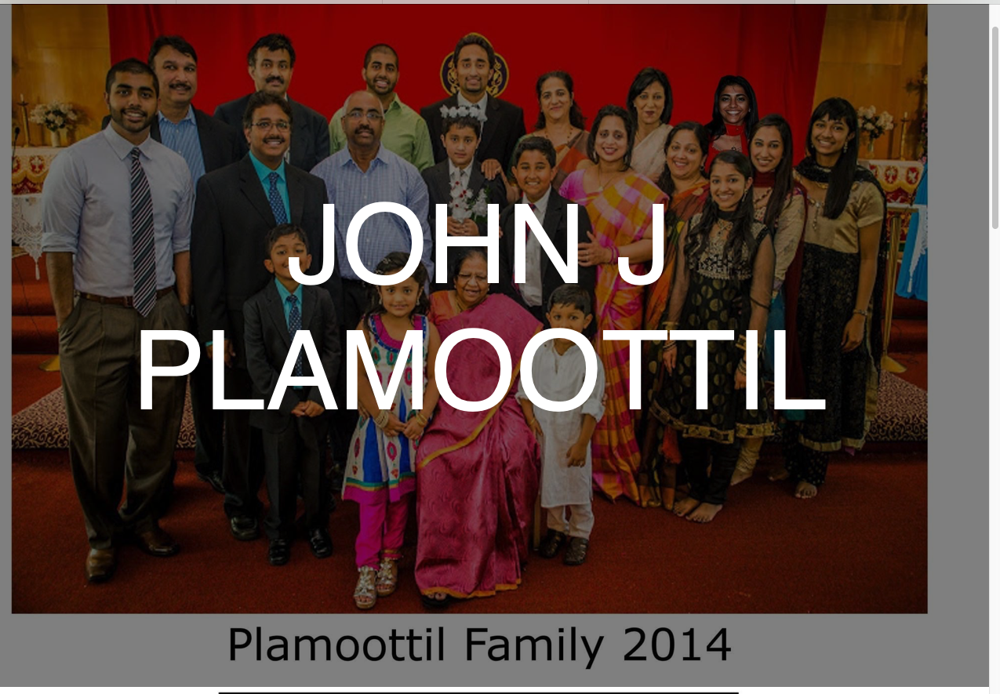
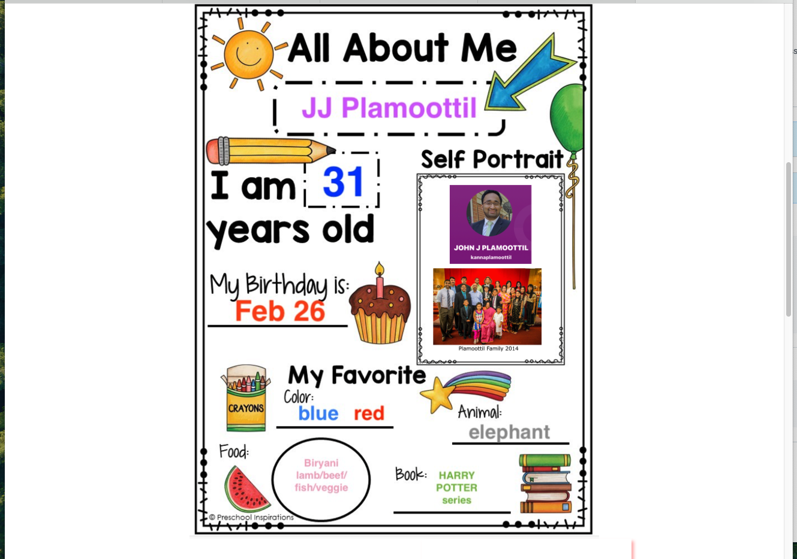
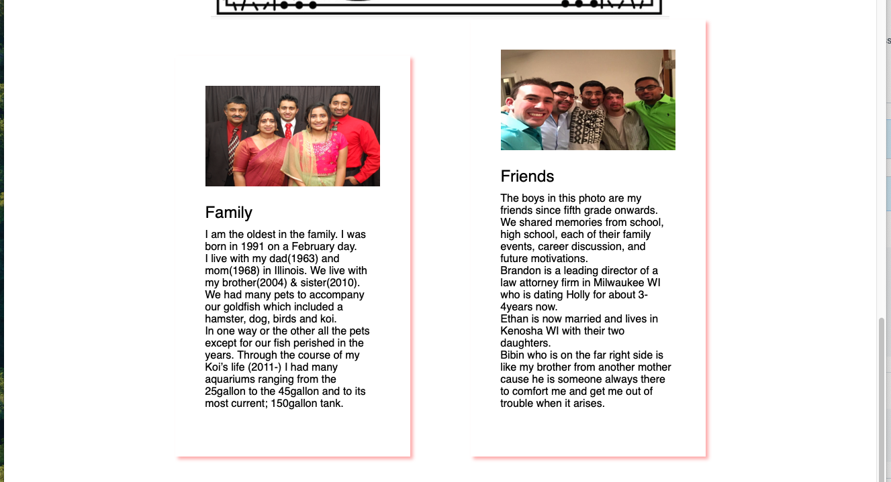
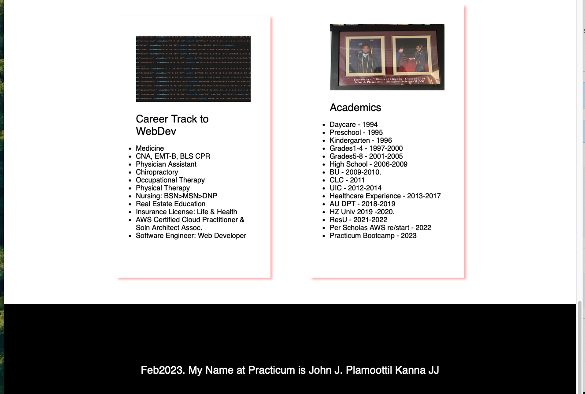
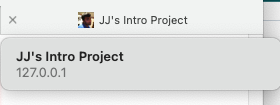

# Introduction-Project-Feb2023
Sprint0 of Practicum SE Program

This project is a personal introduction website created to showcase information about the author, including family, biography, and career highlights. Built using HTML and CSS, it features a visually engaging layout with custom images and responsive design elements. The project demonstrates fundamental web development skills and serves as a creative portfolio piece.

## Images

